

**CS683 – Advanced Computer Architecture**

**Programming Assignment 1 - Chak De Microarchitecture!**

|**Pasham Pranay**|**S Naresh**|
| :-: | :-: |
|**23M1123**|**23M1200**|
|23m1123@iitb.ac.in|23m1200@iitb.ac.in|

Indian Institute of Technology, Bombay

02-09-2024

# Table of Contents
[1	Introduction	]

[2	TASK1	]

[2.1	Task_1A_Tile_it_to_see_it	]

[2.2	Task_1B_Prefetching	]

[2.3	Task_1C_Tiling_Prefetching	]

[3	TASK2	]

[3.1	Task_2A_ Shhh_SIMD_in_action	]

[3.2	Task_2B_Tile_it_again	]

[3.3	Task_2C_Software_prefetching	]

[3.4	Task_2D_ Hum_saath_saath_hain	]

[3.4.1	Tiling_SIMD	]

[3.4.2	Tiling_Prefetching	]

[3.4.3	SIMD_Prefetching	]

[3.4.4	Tiling_SIMD_Prefetching	]

1. # **Introduction**
In this programming assignment, we implemented various types of matrix transpose and 2D convolution computations with a focus on memory architecture optimization. We utilized techniques such as tiling, software prefetching, and SIMD (Single Instruction Multiple Data) instructions. All results were analysed using the perf tool and appropriately plotted.
1. # **TASK1**

1. ## **Task\_1A\_Tile\_it\_to\_see\_it**
TODOs:

1\. Report the L1-D cache MPKI when executing only the naive matrix transpose.

|Subtask|Matrix Size|Tile Size|#Instructions|L1D misses|MPKI|Time taken|
| :- | :- | :- | :- | :- | :- | :- |
||||||||
|Only\_naive|128|-|3485844|38378|11\.00967226|0\.000155|
|Only\_naive|256|-|10464012|151352|14\.46405069|0\.000743|
|Only\_naive|512|-|38433981|531669|13\.83330548|0\.004306|
|Only\_naive|1024|-|150040603|1985309|13\.23181166|0\.014739|
|Only\_naive|2048|-|595603691|8883183|14\.91458689|0\.091646|
|Only\_naive|4096|-|2385050456|45216588|18\.95833603|0\.389373|
|Only\_naive|8192|-|9567746640|164113807|17\.15281698|1\.531687|
|Only\_naive|16384|-|38303082308|658148214|17\.18264365|6\.665323|

2\. Implement the tiled matrix transpose. 

Implemented. Please refer to transpose.c

3\. Report the L1-D cache MPKI when executing only the tiled matrix transpose.

|Subtask|Matrix Size|Tile Size|#Instructions|L1D misses|MPKI|Time taken|
| :- | :- | :- | :- | :- | :- | :- |
||||||||
|only\_tiling|128|32|3900645|28407|7\.282641717|0\.000077|
|only\_tiling|256|32|12138998|119540|9\.847600271|0\.00024|
|only\_tiling|512|32|45077273|440394|9\.769756924|0\.001587|
|only\_tiling|1024|32|176802373|1716272|9\.707290524|0\.005108|
|only\_tiling|2048|32|703018319|6845209|9\.736885676|0\.022346|
|only\_tiling|4096|32|2822755916|27605837|9\.779746397|0\.110915|
|only\_tiling|8192|32|11320629485|110724854|9\.780803633|0\.44257|
|only\_tiling|16384|32|45315528127|440192037|9\.713933726|1\.930082|
|only\_tiling|16384|8|45721279101|270562510|5\.917649622|2\.823611|
|only\_tiling|16384|16|45442908040|456816498|10\.05253664|2\.243349|
|only\_tiling|16384|32|45313504834|441457223|9\.74228819|1\.940978|
|only\_tiling|16384|64|45255400995|433066982|9\.569398845|2\.005246|
|only\_tiling|16384|128|45227438103|427900801|9\.461088643|2\.524508|
|only\_tiling|16384|256|45222448659|428611562|9\.477849491|4\.139685|
|only\_tiling|16384|512|45219380237|429283183|9\.493345127|4\.945008|

4\. Compare the performance by calculating the speedup & 5. Do this for multiple matrix sizes and tile sizes and analyze the results.

|Subtask|Matrix Size|Tile Size|#Instructions|L1D misses|MPKI|Naïve Time|Technique time|Speedup|
| :- | :- | :- | :- | :- | :- | :- | :- | :- |
|tiling\_speed|128|32|4801453|58928|17\.82694|0\.000134|0\.000108|1\.240741|
|tiling\_speed|256|32|15662583|211086|13\.05261|0\.001352|0\.000303|4\.462046|
|tiling\_speed|512|32|59130275|809595|17\.22474|0\.004739|0\.001393|3\.40201|
|tiling\_speed|1024|32|232909870|3612351|18\.92972|0\.015573|0\.00548|2\.841788|
|tiling\_speed|2048|32|926705936|15517508|21\.66509|0\.090067|0\.031388|2\.869472|
|tiling\_speed|4096|32|3717687116|67892604|21\.64354|0\.434561|0\.122503|3\.54735|
|tiling\_speed|8192|32|14896959205|2\.71E+08|21\.6486|1\.577335|0\.475951|3\.31407|
|tiling\_speed|16384|32|59611455799|1\.09E+09|12\.27295|7\.196359|2\.089062|3\.44478|
||||||||||
|tiling\_speed|16384|8|60015267078|9\.15E+08|13\.47709|6\.450709|2\.748974|2\.346588|
|tiling\_speed|16384|16|59739784231|1\.1E+09|13\.69172|7\.066772|2\.323291|3\.042117|
|tiling\_speed|16384|32|59611856813|1\.08E+09|15\.50965|6\.787324|2\.052869|3\.306263|
|tiling\_speed|16384|64|59550272976|1\.08E+09|16\.7448|6\.913622|2\.112824|3\.272219|
|tiling\_speed|16384|128|59525949352|1\.07E+09|18\.26205|6\.871717|2\.670155|2\.573527|
|tiling\_speed|16384|256|59511770421|1\.07E+09|18\.18777|6\.667001|3\.522503|1\.892685|
|tiling\_speed|16384|512|59512534764|1\.07E+09|18\.2192|6\.840065|5\.553526|1\.231662|

6\. Plot the MPKI and speedup for different matrix sizes and tile sizes of your choice. Select the sizes such that you can draw clear conclusions from the results.

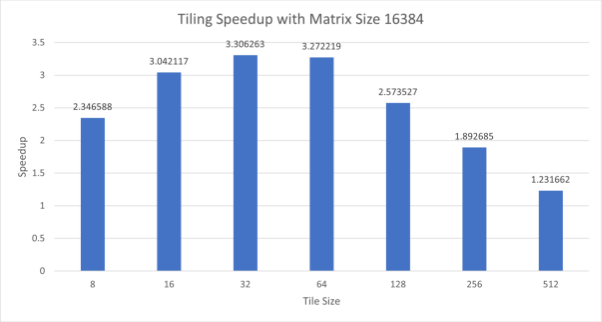

Answer the following: 

1\. Report the changes in L1-D MPKI that you observed while moving from the naive to the tiled matrix transpose, and argue. 

Ans: Data is reported in tables. The L1-D MPKI decreased significantly when moving from the naive matrix transpose to the tiled matrix transpose, especially for larger matrix sizes. This happened because Tiling improves data locality, reducing the number of cache misses by ensuring that data that will be accessed soon is kept in the cache longer.

2\. How much did the L1-D MPKI change for different matrix sizes and tile sizes? Explain the findings. 

Ans: Data is reported in tables. With tiling, the MPKI is consistently lower compared to the naive approach for the same matrix sizes. Tiling significantly reduces L1-D MPKI across all matrix sizes. Smaller tiles have lower MPKI but may increase computation overhead, while larger tiles reduce overhead but can raise MPKI. So, there is a trade-off in choosing tile sizes.

3\. Did you achieve any speedup? If so, how much and what contributed to it? If not, what were the reasons?

Ans: Yes, the tiled implementation achieved a speedup, with the highest being about 4.46x for a 256x256 matrix using a tile size of 32. This speedup was mainly due to fewer L1-D cache misses. As the tile size got larger, the speedup generally decreased. This happened because the benefits of better data locality started to diminish. For very large tiles, the speedup was lower or even negative compared to smaller tiles, likely because of more cache conflicts.
1. ## **Task\_1B\_Prefetching**
TODOs 

1\. Report the number of instructions and L1-D cache MPKI when executing only the naive matrix transpose. 

|Subtask|Matrix Size|Tile Size|#Instructions|L1D misses|MPKI|Time taken|
| :- | :- | :- | :- | :- | :- | :- |
||||||||
|Only\_naive|128|-|3485844|38378|11\.00967226|0\.000155|
|Only\_naive|256|-|10464012|151352|14\.46405069|0\.000743|
|Only\_naive|512|-|38433981|531669|13\.83330548|0\.004306|
|Only\_naive|1024|-|150040603|1985309|13\.23181166|0\.014739|
|Only\_naive|2048|-|595603691|8883183|14\.91458689|0\.091646|
|Only\_naive|4096|-|2385050456|45216588|18\.95833603|0\.389373|
|Only\_naive|8192|-|9567746640|164113807|17\.15281698|1\.531687|
|Only\_naive|16384|-|38303082308|658148214|17\.18264365|6\.665323|

2\. Implement the software-prefetched matrix transpose.

Implemented. Please refer to transpose.c 

3\. Report the number of instructions and L1-D cache MPKI when executing only the software-prefetched matrix transpose. 

|Subtask|Matrix Size|Tile Size|#Instructions|L1D misses|MPKI|Time taken|
| :- | :- | :- | :- | :- | :- | :- |
||||||||
|only\_prefetch|128|-|4047940|51350|12\.68546471|0\.000121|
|only\_prefetch|256|-|12734656|119212|9\.361226562|0\.001067|
|only\_prefetch|512|-|47420056|595510|12\.55818846|0\.003637|
|only\_prefetch|1024|-|185898310|2204148|11\.85674039|0\.014281|
|only\_prefetch|2048|-|739512106|9366121|12\.66527069|0\.075713|
|only\_prefetch|4096|-|2969122554|43733411|14\.72940581|0\.323777|
|only\_prefetch|8192|-|11901195630|174496331|14\.66208408|1\.279374|
|only\_prefetch|16384|-|47634563090|696059582|14\.61249011|5\.042515|

4\. Compare the performance by calculating the speedup. & 5. Do this for multiple matrix sizes and analyze the results. 

|Subtask|Matrix Size|Tile Size|#Instructions|L1D misses|MPKI|Naïve Time|Technique time|Speedup|
| :- | :- | :- | :- | :- | :- | :- | :- | :- |
||||||||||
|prefetch\_speed|128||4930196|70890|17\.82694|0\.000095|0\.000088|1\.079545|
|prefetch\_speed|256||16227296|289283|13\.05261|0\.000758|0\.000714|1\.061625|
|prefetch\_speed|512||61289122|799983|17\.22474|0\.00369|0\.003674|1\.004355|
|prefetch\_speed|1024||241393714|4157944|18\.92972|0\.01452|0\.015971|0\.909148|
|prefetch\_speed|2048||962647196|18222644|21\.66509|0\.088415|0\.082301|1\.074288|
|prefetch\_speed|4096||3863532753|83703777|21\.64354|0\.411597|0\.325925|1\.262858|
|prefetch\_speed|8192||15479020605|3\.35E+08|21\.6486|1\.569016|1\.224227|1\.281638|
|prefetch\_speed|16384||61919604583|1\.34E+09|12\.27295|6\.589215|5\.158913|1\.277249|

6\. Plot the MPKI and speedup for different matrix sizes of your choice. Select matrix sizes such that you can draw clear conclusions from the results. 

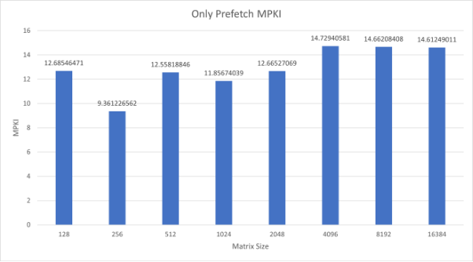

Answer the following: 

1\. Report the change in the number of instructions that you observed while moving from naive to the software-prefetched matrix transpose, and argue. 

Ans: Data is reported in tables. Moving from the naive matrix transpose to the software-prefetched matrix transpose, there was a noticeable increase in the number of instructions executed. For example, with a 128x128 matrix, the number of instructions increased from 3,485,844 in the naive approach to 4,047,940 in the prefetched version. This increase is due to the additional prefetching instructions inserted into the code.

2\. Report the change in L1-D MPKI that you observed while moving from the naive to the software-prefetched matrix transpose, and argue. 

Ans: Data is reported in tables. The L1-D cache MPKI generally decreased when moving from the naive to the software-prefetched matrix transpose, especially for larger matrix sizes. For example, with a 256x256 matrix, the MPKI decreased from 14.46 in the naive approach to 9.36 in the prefetched approach. So, software prefetching mitigated cache misses by ensuring that data is loaded into the cache before it is needed, reducing the number of cache misses during execution.

3\. Did you achieve any speedup? If so, how much and what contributed to it? If not, what were the reasons?

Ans: Yes, software prefetching generally made things faster, especially for larger matrices. For example, with an 8192x8192 matrix, we saw a 1.28x speedup. This improvement came mainly from fewer cache misses and better cache use due to prefetching. However, for smaller matrices, like the 1024x1024 one, prefetching sometimes caused more overhead than benefit, leading speedup of 0.91x. So, prefetching helps with larger matrices but might not be worth it for smaller ones where the basic method works well.

1. ## **Task\_1C\_Tiling\_Prefetching**
TODOs 

1\. Report the number of instructions and L1-D cache MPKI when executing only the naive matrix transpose. 

|Subtask|Matrix Size|Tile Size|#Instructions|L1D misses|MPKI|Time taken|
| :- | :- | :- | :- | :- | :- | :- |
||||||||
|Only\_naive|128|-|3485844|38378|11\.00967226|0\.000155|
|Only\_naive|256|-|10464012|151352|14\.46405069|0\.000743|
|Only\_naive|512|-|38433981|531669|13\.83330548|0\.004306|
|Only\_naive|1024|-|150040603|1985309|13\.23181166|0\.014739|
|Only\_naive|2048|-|595603691|8883183|14\.91458689|0\.091646|
|Only\_naive|4096|-|2385050456|45216588|18\.95833603|0\.389373|
|Only\_naive|8192|-|9567746640|164113807|17\.15281698|1\.531687|
|Only\_naive|16384|-|38303082308|658148214|17\.18264365|6\.665323|

2\. Implement the tiled + software-prefetched matrix transpose. 

Implemented. Please refer to transpose.c 

3\. Report the number of instructions and L1-D cache MPKI when executing only the tiled + software-prefetched matrix transpose. 

|Subtask|Matrix Size|Tile Size|#Instructions|L1D misses|MPKI|Time taken|
| :- | :- | :- | :- | :- | :- | :- |
||||||||
|only\_prefetch\_tiling|128|32|4265859|32973|20\.74418|0\.000067|
|only\_prefetch\_tiling|256|32|13632359|192915|20\.70962|0\.001544|
|only\_prefetch\_tiling|512|32|50813299|705991|15\.10676|0\.001397|
|only\_prefetch\_tiling|1024|32|2E+08|2789837|20\.61796|0\.005644|
|only\_prefetch\_tiling|2048|32|7\.95E+08|11115830|20\.71598|0\.023232|
|only\_prefetch\_tiling|4096|32|3\.19E+09|44928758|20\.58762|0\.100461|
|only\_prefetch\_tiling|8192|32|1\.28E+10|1\.79E+08|20\.52718|0\.416351|
|only\_prefetch\_tiling|16384|32|5\.12E+10|7\.17E+08|20\.48904|1\.70311|
|only\_prefetch\_tiling|16384|8|5\.16E+10|3\.53E+08|20\.49577|2\.004469|
|only\_prefetch\_tiling|16384|16|5\.13E+10|7\.07E+08|7\.72951|1\.653651|
|only\_prefetch\_tiling|16384|32|5\.12E+10|7\.13E+08|14\.15126|1\.692618|
|only\_prefetch\_tiling|16384|64|5\.12E+10|7\.01E+08|13\.89382|1\.694258|
|only\_prefetch\_tiling|16384|128|5\.11E+10|7\.01E+08|13\.96532|1\.8196|
|only\_prefetch\_tiling|16384|256|5\.11E+10|6\.94E+08|13\.98018|3\.332966|
|only\_prefetch\_tiling|16384|512|5\.11E+10|6\.94E+08|14\.07406|3\.791906|

4\. Compare the performance by calculating the speedup. &5. Do this for multiple matrix sizes and analyze the results. 

|Subtask|Matrix Size|Tile Size|#Instructions|L1D misses|MPKI|Naïve Time|Technique time|Speedup|
| :- | :- | :- | :- | :- | :- | :- | :- | :- |
||||||||||
|tiling\_prefetch\_speed|128|32|5164069|56235|17\.82694|0\.000163|0\.000084|1\.940476|
|tiling\_prefetch\_speed|256|32|17091882|323225|13\.05261|0\.000732|0\.000342|2\.140351|
|tiling\_prefetch\_speed|512|32|64805556|1073009|17\.22474|0\.004063|0\.001354|3\.000739|
|tiling\_prefetch\_speed|1024|32|255427130|4762603|18\.92972|0\.01415|0\.005729|2\.46989|
|tiling\_prefetch\_speed|2048|32|1018366534|20800207|21\.66509|0\.083343|0\.02861|2\.913072|
|tiling\_prefetch\_speed|4096|32|4087768072|85275514|21\.64354|0\.439628|0\.10914|4\.028111|
|tiling\_prefetch\_speed|8192|32|16372425311|3\.4E+08|21\.6486|1\.512263|0\.392587|3\.852046|
|tiling\_prefetch\_speed|16384|32|65513987490|1\.36E+09|12\.27295|6\.701818|1\.670461|4\.011957|
|tiling\_prefetch\_speed|16384|8|65918374160|9\.96E+08|13\.47709|6\.56178|1\.958924|3\.349686|
|tiling\_prefetch\_speed|16384|16|65639295701|1\.35E+09|13\.69172|6\.777981|1\.824437|3\.715108|
|tiling\_prefetch\_speed|16384|32|65514753154|1\.36E+09|15\.50965|6\.541292|1\.681578|3\.889972|
|tiling\_prefetch\_speed|16384|64|65455096129|1\.35E+09|16\.7448|7\.159638|1\.733839|4\.129356|
|tiling\_prefetch\_speed|16384|128|65424701172|1\.34E+09|18\.26205|7\.033194|2\.016749|3\.487392|
|tiling\_prefetch\_speed|16384|256|65420964003|1\.34E+09|18\.18777|6\.452934|4\.352535|1\.482569|
|tiling\_prefetch\_speed|16384|512|65415884322|1\.34E+09|18\.2192|6\.797454|4\.63035|1\.468022|

6\. Plot the MPKI and speedup for different matrix sizes and tile sizes of your choice. Select sizes such that you can draw clear conclusions from the results. 

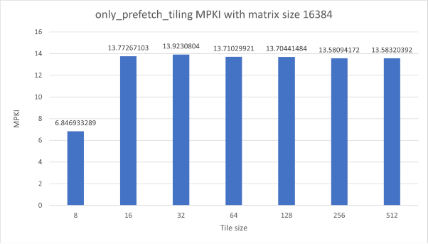

Answer the following: 

1\. Report the change in the number of instructions that you observed while moving from the naive to the software-prefetched matrix transpose, and argue. 

Ans: Data is reported in tables. Moving from the naive matrix transpose to the tiled-software-prefetched matrix transpose, the number of instructions generally increased. For example, 128x128 matrix the instruction count rose from 3,485,844 to 4,265,859 and for a 16384x16384 matrix it increased from 38,303,082,308 to 65,513,987,490. This increase is due to the additional prefetching instructions inserted into the code.

2\. Report the change in L1-D MPKI that you observed while moving from the naive to the software-prefetched matrix transpose, and argue. 

Ans: Data is reported in tables. The L1-D cache MPKI generally decreased when moving from the naive to the tiled-software-prefetched matrix transpose, especially for larger matrix sizes. For a 16384x16384 matrix, MPKI decreased from 17.18 to 12.27. So, software prefetching mitigated cache misses by ensuring that data is loaded into the cache before it is needed, reducing the number of cache misses during execution.

3\. How much did the L1-D MPKI change for different matrix sizes and tile sizes? Explain the findings. 

Ans: Data is reported in tables. For smaller matrices (e.g., 128x128), the MPKI increased with prefetching, suggesting that the overhead of prefetching might outweigh its benefits in such cases and for larger matrices (e.g., 16384x16384), MPKI decreased with prefetching, indicating that the benefits of prefetching become more apparent as the matrix size increases, reducing cache misses significantly.

4\. Did you achieve any speedup? If so, how much and what contributed to it? If not, what were the reasons?

Ans: Yes, speedup was achieved with the software-prefetched and tiled matrix transpose. The speedup ranged from 1.94x for smaller matrices (like 128x128) to 4.01x for larger matrices (such as 16384x16384). This improvement is due to a significant reduction in L1-D cache misses, which lowered the MPKI from 11.01 (naive) to 17.83 (prefetched) for the 128x128 matrix and from 17.18 (naive) to 12.27 (prefetched) for the 16384x16384 matrix. Tiling improves the data locality in the cache. Prefetching further enhances this by loading data into the cache before it is needed, thereby reducing waiting time. Together, these techniques optimize data access patterns and ensure that the cache is used more effectively leading to improvements in the performance particularly for larger matrices where these benefits are more evident.

Final Comparisons:

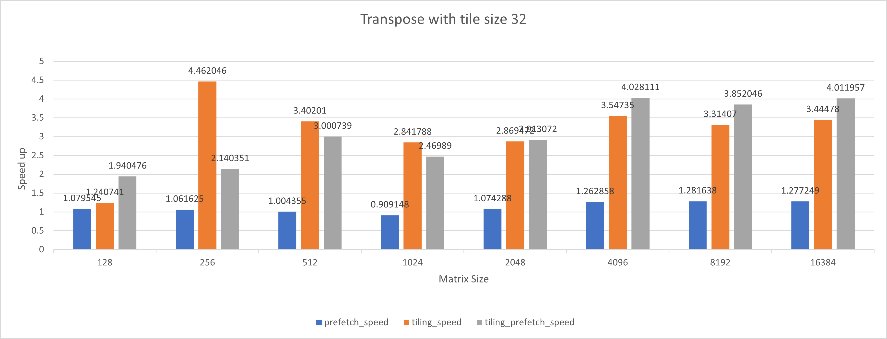
1. # **TASK2**

1. ## **Task\_2A\_** **Shhh\_SIMD\_in\_action**
TODOs 

1\. Report the number of instructions when executing only the naive convolution algorithm. 

|Subtask|Matrix Size|Kernel Size|Tile Size|#Instructions|L1D misses|MPKI|Naive time|
| :- | :- | :- | :- | :- | :- | :- | :- |
|||||||||
|Only\_naive|128|16|-|123388703|28689|0\.23250913|0\.011982|
|Only\_naive|256|16|-|555398702|1657735|2\.984765708|0\.055147|
|Only\_naive|512|16|-|2355541933|11931318|5\.065211463|0\.228014|
|Only\_naive|1024|16|-|9701154856|48978043|5\.048681701|0\.930878|
|Only\_naive|2048|16|-|39368679587|198628918|5\.045353821|3\.533234|
|Only\_naive|4096|16|-|1\.58626E+11|801657956|5\.053771976|13\.746239|
|Only\_naive|8192|16|-|6\.36806E+11|3211165640|5\.042615506|54\.227171|
|||||||||
|Only\_naive|8192|4|-|51745344232|64760225|1\.251517909|4\.729144|
|Only\_naive|8192|8|-|1\.69942E+11|262297630|1\.543454161|15\.844957|
|Only\_naive|8192|16|-|6\.36812E+11|3217334808|5\.05224965|54\.545814|

2\. Implement the SIMD 2D convolution algorithm. 

Implemented. Please refer transpose.c.

3\. Report the number of instructions when executing only the SIMD 2D convolution algorithm. 

|Subtask|Matrix Size|Kernel Size|Tile Size|#Instructions|L1D misses|MPKI|
| :- | :- | :- | :- | :- | :- | :- |
||||||||
|only\_simd\_128|128|8|16|28336272|44760|1\.579600873|
|only\_simd\_128|256|8|16|115573748|74387|0\.643632324|
|only\_simd\_128|512|8|16|470352609|1083242|2\.303042397|
|only\_simd\_128|1024|8|16|1901910285|4715538|2\.479369315|
|only\_simd\_128|2048|8|16|7652024479|19842836|2\.593148526|
|only\_simd\_128|4096|8|16|30715506718|76106092|2\.477774262|
|only\_simd\_128|8192|8|16|1\.23089E+11|309361723|2\.513322732|
||||||||
|only\_simd\_128|8192|4|16|41868433559|74880045|1\.788460629|
|only\_simd\_128|8192|8|16|1\.23088E+11|256532530|2\.084141904|
|only\_simd\_128|8192|16|16|4\.42391E+11|3217187234|7\.272268223|
||||||||
|only\_simd\_256|128|8|16|16891730|27217|1\.611261842|
|only\_simd\_256|256|8|16|67200894|70472|1\.048676525|
|only\_simd\_256|512|8|16|271440680|1111632|4\.095303622|
|only\_simd\_256|1024|8|16|1094327296|5098769|4\.65927243|
|only\_simd\_256|2048|8|16|4405805081|21065750|4\.781362228|
|only\_simd\_256|4096|8|16|17667719485|81069385|4\.588559665|
|only\_simd\_256|8192|8|16|70805501825|303173159|4\.281774031|
||||||||
|only\_simd\_256|8192|4|16|28989095454|74390858|2\.566166927|
|only\_simd\_256|8192|8|16|70805578721|332909338|4\.701738818|
|only\_simd\_256|8192|16|16|2\.32884E+11|3217743073|13\.81693614|

4\. Compare the performance by calculating the speedup. & 5. Do this using SIMD registers of width 128 bits and 256 bits (and 512 bits if available) and compare the speedups.  & 6. Do this for multiple matrix sizes and kernel sizes and analyze the results. 

|Subtask|Matrix Size|Kernel Size|Tile Size|#Instructions|L1D misses|MPKI|Naive time|Technique time|Speedup|
| :- | :- | :- | :- | :- | :- | :- | :- | :- | :- |
|simd\_128\_speed|128|8|-|64023425|37571|0\.586832085|0\.04591|0\.003064|1\.49836|
|simd\_128\_speed|256|8|-|266221048|106629|0\.40052806|0\.016244|0\.01287|1\.26216|
|simd\_128\_speed|512|8|-|1089703676|1932632|1\.77353903|0\.060522|0\.053721|1\.126599|
|simd\_128\_speed|1024|8|-|4413391412|8989631|2\.036898648|0\.244407|0\.214935|1\.137121|
|simd\_128\_speed|2048|8|-|17768621927|35886003|2\.019627811|0\.973755|0\.862434|1\.129078|
|simd\_128\_speed|4096|8|-|71320474386|139973199|1\.962594896|3\.954417|3\.399999|1\.163064|
|simd\_128\_speed|8192|8|-|2\.85777E+11|568103251|1\.987925939|15\.870408|13\.933223|1\.139034|
|||||||||||
|simd\_128\_speed|8192|4|-|86365049899|135533460|1\.569309115|4\.705897|4\.352154|1\.08128|
|simd\_128\_speed|8192|8|-|2\.85777E+11|484812627|1\.696473564|15\.832497|14\.104094|1\.122546|
|simd\_128\_speed|8192|16|-|1\.07196E+12|6434786870|6\.002827953|56\.984327|49\.591826|1\.149067|
|||||||||||
|simd\_256\_speed|128|8|-|52589668|38018|0\.722917665|0\.0044525|0\.00184|2\.459239|
|simd\_256\_speed|256|8|-|217811836|103279|0\.474166151|0\.016233|0\.007099|2\.28666|
|simd\_256\_speed|512|8|-|890709621|2083381|2\.33901257|0\.069143|0\.032826|2\.106349|
|simd\_256\_speed|1024|8|-|3606198935|9191993|2\.548942298|0\.24188|0\.124121|1\.948744|
|simd\_256\_speed|2048|8|-|14516893613|37014613|2\.549761263|0\.972744|0\.501253|1\.940625|
|simd\_256\_speed|4096|8|-|58270151773|148181073|2\.543001322|3\.972964|2\.06629|1\.922752|
|simd\_256\_speed|8192|8|-|2\.3349E+11|592682243|2\.538365015|15\.809238|8\.5994|1\.838412|
|||||||||||
|simd\_256\_speed|8192|4|-|73481006063|134775079|1\.834148527|4\.691615|2\.994651|1\.566665|
|simd\_256\_speed|8192|8|-|2\.3349E+11|581278097|2\.489521949|15\.784101|8\.60303|1\.834714|
|simd\_256\_speed|8192|16|-|8\.62442E+11|6438194639|7\.465071812|56\.40051|31\.391965|1\.796654|

7\. Plot the speedup for the different matrix sizes and kernel sizes of your choice. Select the sizes such that you can draw clear conclusions from the results.

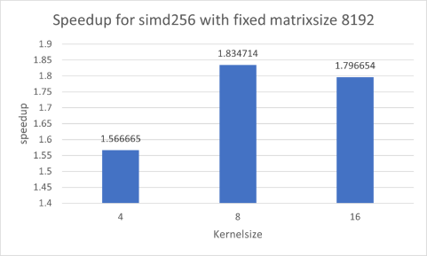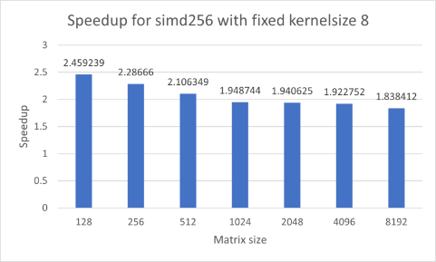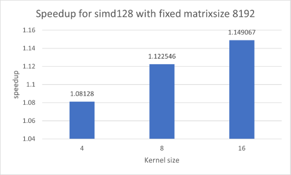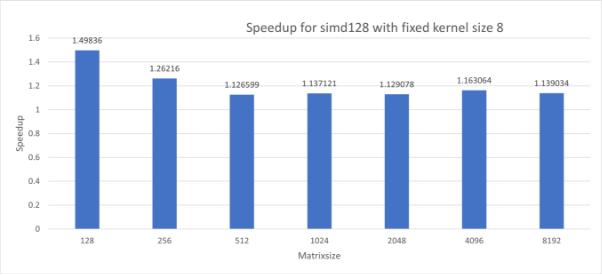

Answer the following: 

1\. Report the change in the number of instructions that you observed while moving from the naive to the SIMD 2D convolution algorithm, and argue. 

Ans: Number of instructions decreased while moving from naïve to SIMD.

<table><tr><th rowspan="2" valign="top">S.No</th><th rowspan="2" valign="top">SIMD</th><th colspan="3" valign="top">Number of less instructions</th><th rowspan="1" valign="top">remarks</th></tr>
<tr><td valign="top">Kernel 4x4</td><td valign="top">Kernel 8x8</td><td valign="top">Kernel 16x16</td></tr>
<tr><td valign="top">1</td><td valign="top">128bit</td><td valign="top">-9.877E+09</td><td valign="top">
-4.685E+10

</td><td valign="top">-1.944E+11</td><td rowspan="2" valign="top">Image size = 8192x8192</td></tr>
<tr><td valign="top">2</td><td valign="top">256bit</td><td valign="top">
-2.276E+10

</td><td valign="top">
-9.914E+10

</td><td valign="top">
-4.039E+11

</td></tr>
</table>
This decrease is because of reduced number of additions and multiplications instructions because of vectorized MAC (fmadd) operations in SIMD.

Reductions in instructions is more in 256bit SIMD than 128bit SIMD because 256bit vector size is twice that of 128bit.

2\. Did you achieve any speedup? If so, how much and what contributed to it? If not, what were the reasons?

Ans: Yes, 1.163064x and 1.192275x for 128bit SMID and 256bit SIMD respectively. Vectorised MAC operations made SIMD faster.

1. ## **Task\_2B\_Tile\_it\_again**
TODOs 

1\. Report the L1-D cache MPKI when executing only the naive 2D convolution. 

|Subtask|Matrix Size|Kernel Size|Tile Size|#Instructions|L1D misses|MPKI|Naive time|
| :- | :- | :- | :- | :- | :- | :- | :- |
|||||||||
|Only\_naive|128|16|-|123388703|28689|0\.23250913|0\.011982|
|Only\_naive|256|16|-|555398702|1657735|2\.984765708|0\.055147|
|Only\_naive|512|16|-|2355541933|11931318|5\.065211463|0\.228014|
|Only\_naive|1024|16|-|9701154856|48978043|5\.048681701|0\.930878|
|Only\_naive|2048|16|-|39368679587|198628918|5\.045353821|3\.533234|
|Only\_naive|4096|16|-|1\.58626E+11|801657956|5\.053771976|13\.746239|
|Only\_naive|8192|16|-|6\.36806E+11|3211165640|5\.042615506|54\.227171|
|||||1|1|1000||
|Only\_naive|8192|4|-|51745344232|64760225|1\.251517909|4\.729144|
|Only\_naive|8192|8|-|1\.69942E+11|262297630|1\.543454161|15\.844957|
|Only\_naive|8192|16|-|6\.36812E+11|3217334808|5\.05224965|54\.545814|

2\. Implement the tiled 2D convolution. 

Implemented. Please refer transpose.c.

3\. Report the L1-D cache MPKI when executing only the tiled 2D convolution.

|Subtask|Matrix Size|Kernel Size|Tile Size|#Instructions|L1D misses|MPKI|
| :- | :- | :- | :- | :- | :- | :- |
||||||||
|only\_tiling|128|8|16|39036018|33373|0\.854928389|
|only\_tiling|256|8|16|161005074|221989|1\.378770212|
|only\_tiling|512|8|16|657039626|1046159|1\.592231212|
|only\_tiling|1024|8|16|2659067507|4430395|1\.666146116|
|only\_tiling|2048|8|16|10702557021|17867216|1\.66943432|
|only\_tiling|4096|8|16|42961277152|70174826|1\.633443665|
|only\_tiling|8192|8|16|1\.72146E+11|279030523|1\.620897325|
||||||||
|only\_tiling|8192|4|16|53950956051|161267372|2\.989147622|
|only\_tiling|8192|8|16|1\.7215E+11|285848876|1\.660465662|
|only\_tiling|8192|16|16|6\.39019E+11|3233069568|5\.059428337|
||||||||
|only\_tiling|8192|8|8|1\.72234E+11|328338680|1\.906357779|
|only\_tiling|8192|8|16|1\.72149E+11|279299073|1\.622423716|
|only\_tiling|8192|8|32|1\.7211E+11|251474658|1\.461126462|

` `4. Compare the performance by calculating the speedup. &5. Do this for multiple matrix sizes and kernel sizes and analyze the results. 

|Subtask|Matrix Size|Kernel Size|Tile Size|#Instructions|L1D misses|MPKI|Naive time|Technique time|Speedup|
| :- | :- | :- | :- | :- | :- | :- | :- | :- | :- |
|||||||||||
|speed\_tiling|128|8|16|74740929|45811|0\.612930567|0\.004001|0\.00386|1\.036528|
|speed\_tiling|256|8|16|311630759|265010|0\.850397441|0\.014781|0\.015523|0\.9522|
|speed\_tiling|512|8|16|1276564765|1839106|1\.440667995|0\.06094|0\.061237|0\.99515|
|speed\_tiling|1024|8|16|5171600091|8263917|1\.597942001|0\.242356|0\.247594|0\.978844|
|speed\_tiling|2048|8|16|20819150269|33213727|1\.595344986|0\.974025|1\.006387|0\.967843|
|speed\_tiling|4096|8|16|83569644619|128119081|1\.533081558|3\.971622|4\.144686|0\.958244|
|speed\_tiling|8192|8|16|3\.34839E+11|550403981|1\.643786907|15\.787348|17\.00953|0\.928147|
|||||||||||
|speed\_tiling|8192|4|16|98450299121|221465933|2\.249520164|4\.704134|5\.244086|0\.897036|
|speed\_tiling|8192|8|16|3\.34841E+11|548764869|1\.638883409|15\.858832|17\.060859|0\.929545|
|speed\_tiling|8192|16|16|1\.2686E+12|6452493163|5\.086328779|55\.961641|58\.108468|0\.963055|
|||||||||||
|speed\_tiling|8192|8|8|3\.34926E+11|599122936|1\.788819376|16\.0503353|17\.552841|0\.914401|
|speed\_tiling|8192|8|16|3\.34842E+11|537796597|1\.606120918|15\.874737|17\.06321|0\.930349|
|speed\_tiling|8192|8|32|3\.34803E+11|523874254|1\.564723436|15\.882962|16\.839591|0\.943192|

6\. Plot the MPKI and speedup for different matrix sizes, kernel sizes, and tile sizes of your choice. Select the sizes such that you can draw clear conclusions from the results.

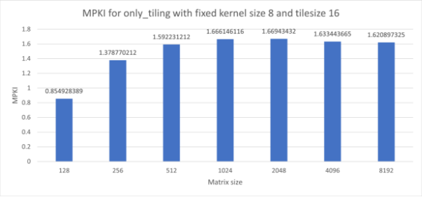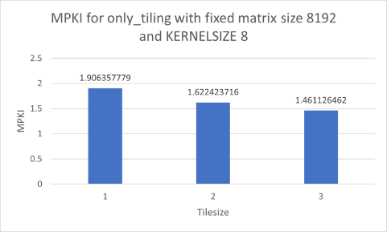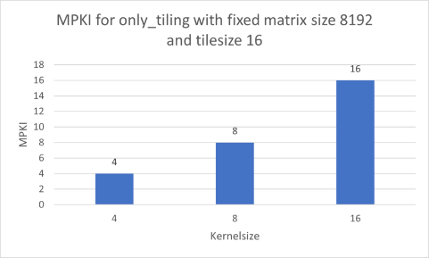

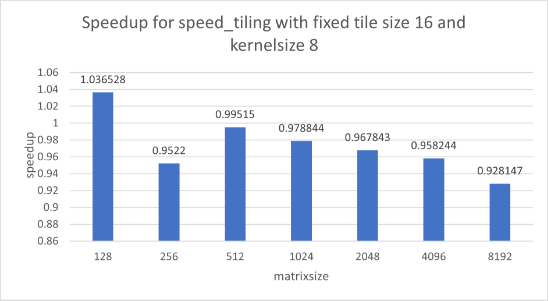

Answer the following: 

1. Report the change in L1-D MPKI that you observed while moving from the naive to the tiled 2D convolution, and argue. 

   Ans: MPKI is more for tile <16x16 and less for tile >16x16 compared to that of naive. this is because fetched data is not there in cache for reuse at the tile boundary, these will be again miss. For larger tile sizes, more elements are getting reused.

1. How much did the L1-D MPKI change for different matrix sizes, kernel sizes, and tile sizes? Explain the findings. 

   Ans:

<table>   <tr><th valign="top">S.No</th><th valign="top"></th><th valign="top">Tile 8x8</th><th valign="top">Tile 16x16</th><th valign="top">Tile 32x32</th><th valign="top">Remakrs</th></tr>
   <tr><td valign="top">1</td><td valign="top">Kernel 4x4</td><td valign="top"></td><td valign="top">2\.388417778</td><td valign="top"></td><td rowspan="3" valign="top">
= tiling MPKIprefetch MPKI

image size = 8192x8192
</td></tr>
   <tr><td valign="top">2</td><td valign="top">Kernel 8x8</td><td valign="top">1\.235124326</td><td valign="top">1\.075811452</td><td valign="top">0\.946660095</td></tr>
   <tr><td valign="top">3</td><td valign="top">Kernel 16x16</td><td valign="top"></td><td valign="top">1\.001420889</td><td valign="top"></td></tr>
</table>

   As tile size and kernel size increased, MPKI is decreasing this is mainly due to more number of elements getting reused. 

1. Did you achieve any speedup? If so, how much and what contributed to it? If not, what were the reasons?

   Ans: No(max of 0.963055) and some times we are getting slightly above 1x. there is no significant improvement in speed since MPKI is more compared to naïve.
   1. ## **Task\_2C\_Software\_prefetching**
Note: Turned off hardware prefetching to see the effects of software prefetching. 

TODOs 

1\. Report the number of instructions and L1-D cache MPKI when executing only the naive 2D convolution. 

|Subtask|Matrix Size|Kernel Size|Tile Size|#Instructions|L1D misses|MPKI|Naive time|
| :- | :- | :- | :- | :- | :- | :- | :- |
|||||||||
|Only\_naive|128|16|-|123388703|28689|0\.23250913|0\.011982|
|Only\_naive|256|16|-|555398702|1657735|2\.984765708|0\.055147|
|Only\_naive|512|16|-|2355541933|11931318|5\.065211463|0\.228014|
|Only\_naive|1024|16|-|9701154856|48978043|5\.048681701|0\.930878|
|Only\_naive|2048|16|-|39368679587|198628918|5\.045353821|3\.533234|
|Only\_naive|4096|16|-|1\.58626E+11|801657956|5\.053771976|13\.746239|
|Only\_naive|8192|16|-|6\.36806E+11|3211165640|5\.042615506|54\.227171|
|||||1|1|1000||
|Only\_naive|8192|4|-|51745344232|64760225|1\.251517909|4\.729144|
|Only\_naive|8192|8|-|1\.69942E+11|262297630|1\.543454161|15\.844957|
|Only\_naive|8192|16|-|6\.36812E+11|3217334808|5\.05224965|54\.545814|

2\. Implement the software-prefetched 2D convolution. 

Implemented. Please refer transpoce.c.

3\. Report the number of instructions and L1-D cache MPKI when executing only the software-prefetched 2D convolution. 

|Subtask|Matrix Size|Kernel Size|Tile Size|#Instructions|L1D misses|MPKI|
| :- | :- | :- | :- | :- | :- | :- |
||||||||
|only\_prefetch|128|8|16|39141207|29294|0\.748418412|
|only\_prefetch|256|8|16|161415713|66367|0\.411155759|
|only\_prefetch|512|8|16|658867344|883044|1\.340245511|
|only\_prefetch|1024|8|16|2666119731|4217851|1\.582018598|
|only\_prefetch|2048|8|16|10731431087|16858962|1\.570989168|
|only\_prefetch|4096|8|16|43075500331|67764542|1\.573157398|
|only\_prefetch|8192|8|16|1\.72607E+11|245496139|1\.422287005|
||||||||
|only\_prefetch|8192|4|16|54414942350|73889108|1\.357882685|
|only\_prefetch|8192|8|16|1\.72605E+11|271659614|1\.573877384|
|only\_prefetch|8192|16|16|6\.39469E+11|3222105914|5\.038721939|
||||||||
|only\_prefetch|8192|8|8|1\.72606E+11|272140123|1\.57665727|
|only\_prefetch|8192|8|16|1\.72606E+11|245152220|1\.420302694|
|only\_prefetch|8192|8|32|1\.72607E+11|272184475|1\.576901126|

4\. Compare the performance by calculating the speedup. & 5. Do this for multiple matrix sizes and kernel sizes and analyze the results. 

|Subtask|Matrix Size|Kernel Size|Tile Size|#Instructions|L1D misses|MPKI|Naive time|Technique time|Speedup|
| :- | :- | :- | :- | :- | :- | :- | :- | :- | :- |
|||||||||||
|speed\_prefetch|128|8|-|7483305|37965|5\.073293151|0\.004411|0\.003825|1\.153203|
|speed\_prefetch|256|8|-|312156064|117044|0\.374953472|0\.026007|0\.17725|1\.146725|
|speed\_prefetch|512|8|-|1278638103|1693845|1\.324725891|0\.060817|0\.061398|0\.990537|
|speed\_prefetch|1024|8|-|5177815830|8199536|1\.583589735|0\.242491|0\.241543|1\.003925|
|speed\_prefetch|2048|8|-|20847725533|29671663|1\.423256602|0\.975479|0\.974775|1\.000722|
|speed\_prefetch|4096|8|-|83678496683|131905033|1\.576331295|3\.966174|3\.179857|1\.044869|
|speed\_prefetch|8192|8|-|3\.35293E+11|530623918|1\.582566598|15\.820009|15\.514372|1\.0197|
||||-|||||||
|speed\_prefetch|8192|4|-|98910034645|134728590|1\.362132674|4\.690238|4\.701088|0\.997692|
|speed\_prefetch|8192|8|-|3\.35295E+11|531296494|1\.584566245|15\.909039|15\.604701|1\.019503|
|speed\_prefetch|8192|16|-|1\.26905E+12|6430309373|5\.067041171|57\.906053|56\.906053|1\.004825|

6\. Plot the MPKI and speedup for different matrix sizes and kernel sizes of your choice. Select the sizes such that you can draw clear conclusions from the results.

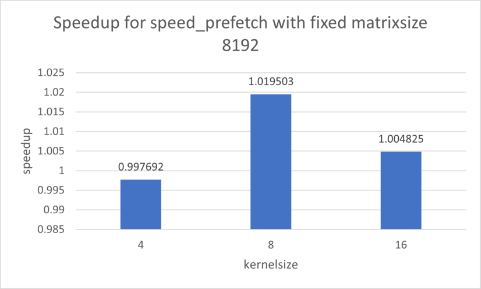

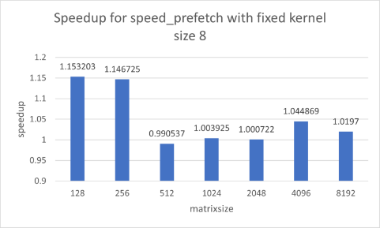

` `Answer the following: 

1\. Report the change in the number of instructions that you observed while moving from the naive to the software-prefetched matrix multiplication algorithm, and argue. 

Ans: Data is reported in tables. Moving from the naive matrix transpose to the software-prefetched matrix transpose, there was a noticeable increase in the number of instructions executed. This increase is due to the additional prefetching instructions inserted into the code.

2\. Report the change in L1-D MPKI that you observed while moving from the naive to the software-prefetched matrix multiplication algorithm, and argue. 

Ans: Data is reported in tables. The L1-D MPKI  decreased significantly with software prefetching compared to the naive approach. Software prefetching helps in reducing cache misses by loading data into the cache before it is actually needed by the processor.

3\. Did you achieve any speedup? If so, how much and what contributed to it? If not, what were the reasons?

Ans: Speedup was achieved in most cases, with the most significant speedup observed for smaller matrix sizes. For instance, with a matrix size of 128 and kernel size of 8, a speedup of approximately 1.15x was observed. The speedup is largely due to the reduction in cache misses. But for larger matrices, the speedup was less or even negligible due to overhead instructions associated with prefetching.

1. ## **Task\_2D\_** **Hum\_saath\_saath\_hain**

1. ### **Tiling\_SIMD**

1\. Report the number of instructions and L1-D cache MPKI

|Subtask|Matrix Size|Kernel Size|Tile Size|#Instructions|L1D misses|MPKI|
| :- | :- | :- | :- | :- | :- | :- |
||||||||
|only\_tiling\_simd|128|8|16|17027100|37812|2\.220695245|
|only\_tiling\_simd|256|8|16|67534278|216304|3\.202877211|
|only\_tiling\_simd|512|8|16|272865363|1208352|4\.428381773|
|only\_tiling\_simd|1024|8|16|1100011030|4952786|4\.50248758|
|only\_tiling\_simd|2048|8|16|4425960380|19735521|4\.459036979|
|only\_tiling\_simd|4096|8|16|17776122554|77848025|4\.379359152|
|only\_tiling\_simd|8192|8|16|71217331111|341027640|4\.788548443|
||||||||
|only\_tiling\_simd|8192|4|16|29402639199|160774386|5\.468025673|
|only\_tiling\_simd|8192|8|16|71216318808|322681233|4\.531001299|
|only\_tiling\_simd|8192|16|16|2\.33291E+11|3239001321|13\.883975|
||||||||
|only\_tiling\_simd|8192|8|8|71300289286|374707498|5\.255343306|
|only\_tiling\_simd|8192|8|16|71216017950|319577544|4\.487439107|
|only\_tiling\_simd|8192|8|32|71178525184|308233817|4\.330432756|

2\. Compare the performance by calculating the speedup. & 3. Do this for multiple matrix sizes, tile sizes and kernel sizes and analyze the results. 

|Subtask|Matrix Size|Kernel Size|Tile Size|#Instructions|L1D misses|MPKI|Naive time|Technique time|Speedup|
| :- | :- | :- | :- | :- | :- | :- | :- | :- | :- |
|||||||||||
|speed\_tiling\_simd|128|8|16|52637062|46760|0\.888347454|0\.003931|0\.001908|2\.060273|
|speed\_tiling\_simd|256|8|16|218208696|255864|1\.172565552|0\.016187|0\.007473|2\.166064|
|speed\_tiling\_simd|512|8|16|892247251|2069655|2\.319598068|0\.0618838|0\.032834|1\.883353|
|speed\_tiling\_simd|1024|8|16|3612553678|8992264|2\.489171041|0\.242607|0\.130063|1\.865304|
|speed\_tiling\_simd|2048|8|16|14547335973|35782264|2\.459712491|0\.97537|0\.536668|1\.817455|
|speed\_tiling\_simd|4096|8|16|58373362991|144842269|2\.481307596|3\.944012|2\.211195|1\.783656|
|speed\_tiling\_simd|8192|8|16|2\.33903E+11|580688018|2\.482600427|15\.849207|9\.112852|1\.739215|
|||||||||||
|speed\_tiling\_simd|8192|4|16|73898254736|221565703|2\.998253528|4\.697859|3\.737324|1\.257011|
|speed\_tiling\_simd|8192|8|16|2\.33902E+11|589021803|2\.518239189|15\.854609|9\.105986|1\.741119|
|speed\_tiling\_simd|8192|16|16|8\.6286E+11|6453624370|7\.479343314|56\.542698|32\.117133|1\.760515|
|||||||||||
|speed\_tiling\_simd|8192|8|8|2\.33985E+11|607878106|2\.597932185|15\.942267|9\.508444|1\.676643|
|speed\_tiling\_simd|8192|8|16|2\.33907E+11|562378443|2\.404282918|15\.8348|9\.069662|1\.745909|
|speed\_tiling\_simd|8192|8|32|2\.33865E+11|557291810|2\.382962583|15\.8348|9\.069662|1\.745909|

3\. Plot the speedup for different matrix sizes and kernel sizes of your choice. Select the sizes such that you can draw clear conclusions from the results.

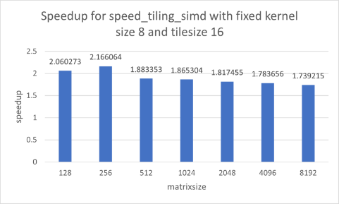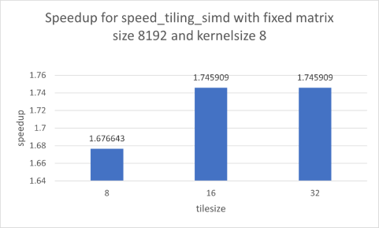

1. ### **Tiling\_Prefetching**

1\. Report the number of instructions and L1-D cache MPKI

|Subtask|Matrix Size|Kernel Size|Tile Size|#Instructions|L1D misses|MPKI|
| :- | :- | :- | :- | :- | :- | :- |
||||||||
|only\_tiling\_prefetching|128|8|16|39264967|35915|0\.914683056|
|only\_tiling\_prefetching|256|8|16|161761628|240861|1\.48898724|
|only\_tiling\_prefetching|512|8|16|660355251|1302882|1\.97300165|
|only\_tiling\_prefetching|1024|8|16|2672419853|5362208|2\.006499089|
|only\_tiling\_prefetching|2048|8|16|10757136875|21391071|1\.988546883|
|only\_tiling\_prefetching|4096|8|16|43179839922|87743956|2\.03205839|
|only\_tiling\_prefetching|8192|8|16|1\.7302E+11|344437312|1\.990733913|
||||||||
|only\_tiling\_prefetching|8192|4|16|54824452850|228007520|4\.158865399|
|only\_tiling\_prefetching|8192|8|16|1\.73021E+11|357310264|2\.065121111|
|only\_tiling\_prefetching|8192|16|16|6\.39901E+11|3300812284|5\.158319771|
||||||||
|only\_tiling\_prefetching|8192|8|8|1\.73108E+11|352592734|2\.036832583|
|only\_tiling\_prefetching|8192|8|16|1\.73022E+11|352937492|2\.039839903|
|only\_tiling\_prefetching|8192|8|32|1\.73108E+11|320501381|1\.851449541|

2\. Compare the performance by calculating the speedup. & 3. Do this for multiple matrix sizes, tile sizes and kernel sizes and analyze the results. 

|Subtask|Matrix Size|Kernel Size|Tile Size|#Instructions|L1D misses|MPKI|Naive time|Technique time|Speedup||
| :- | :- | :- | :- | :- | :- | :- | :- | :- | :- | :- |
||||||||||||
|speed\_tiling\_prefetch|128|8|16|74927991|46283|0\.617699733|0\.005227|0\.003859|1\.354496||
|speed\_tiling\_prefetch|256|8|16|312487589|285042|0\.912170627|0\.018834|0\.017804|1\.057852||
|speed\_tiling\_prefetch|512|8|16|1279845998|2140470|1\.672443406|0\.067757|0\.060461|1\.120673||
|speed\_tiling\_prefetch|1024|8|16|5184157558|9233025|1\.781007791|0\.242877|0\.241562|1\.005444||
|speed\_tiling\_prefetch|2048|8|16|20873458703|37228816|1\.783548023|0\.973842|0\.962809|1\.011459||
|speed\_tiling\_prefetch|4096|8|16|83786766940|151467785|1\.807776938|4\.01306|3\.999412|1\.003413||
|speed\_tiling\_prefetch|8192|8|16|3\.35708E+11|606085333|1\.805395969|15\.812811|16\.077562|0\.983533||
||||||||||||
|speed\_tiling\_prefetch|8192|4|16|99318304526|289481116|2\.914680404|4\.7030228|4\.91948|0\.9561||
|speed\_tiling\_prefetch|8192|8|16|3\.35707E+11|606008411|1\.805171452|15\.813727|16\.258624|0\.972636||
|speed\_tiling\_prefetch|8192|16|16|1\.26945E+12|6510063125|5\.128243099|56\.512809|57\.890704|0\.976198||
||||||||||||
|speed\_tiling\_prefetch|8192|8|8|3\.35794E+11|608249606|1\.811376382|15\.921323|17\.546865|0\.90736||
|speed\_tiling\_prefetch|8192|8|16|3\.35706E+11|605561882|1\.803847869|15\.893373|16\.106927|0\.986741||
|speed\_tiling\_prefetch|8192|8|32|3\.35667E+11|590060327|1\.75787346|16\.00744|15\.722837|1\.0181||

3\. Plot the speedup for different matrix sizes and kernel sizes of your choice. Select the sizes such that you can draw clear conclusions from the results.

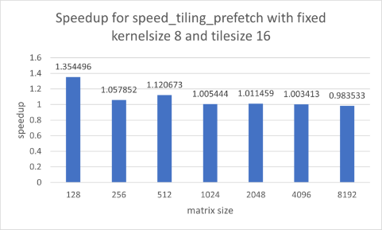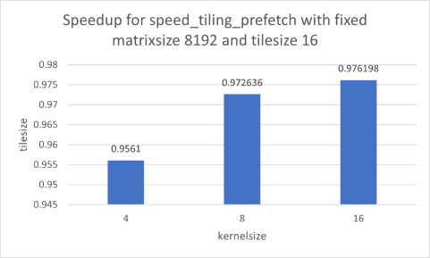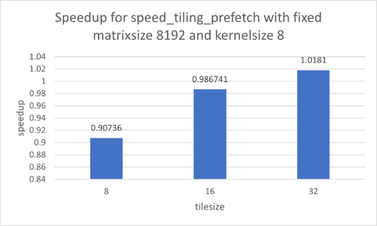

1. ### **SIMD\_Prefetching**

1\. Report the number of instructions and L1-D cache MPKI

|Subtask|Matrix Size|Kernel Size|Tile Size|#Instructions|L1D misses|MPKI|
| :- | :- | :- | :- | :- | :- | :- |
||||||||
|only\_prefetch\_simd|128|8|16|20974933|65863|3\.140081544|
|only\_prefetch\_simd|256|8|16|84516483|227871|2\.696172296|
|only\_prefetch\_simd|512|8|16|342726785|1607134|4\.689257071|
|only\_prefetch\_simd|1024|8|16|1384021111|7765322|5\.610696209|
|only\_prefetch\_simd|2048|8|16|5568757007|33703401|6\.052230499|
|only\_prefetch\_simd|4096|8|16|22360169819|149659489|6\.693128461|
|only\_prefetch\_simd|8192|8|16|89581842797|585077118|6\.53120208|
||||||||
|only\_prefetch\_simd|8192|4|16|35443505374|368715292|10\.40290141|
|only\_prefetch\_simd|8192|8|16|89577497514|590726652|6\.594587574|
|only\_prefetch\_simd|8192|16|16|2\.93866E+11|4163894819|14\.16935641|
||||||||
|only\_prefetch\_simd|8192|8|8|89578960372|596136127|6\.654867667|
|only\_prefetch\_simd|8192|8|16|89579954444|594455549|6\.636033169|
|only\_prefetch\_simd|8192|8|32|89580254216|598259431|6\.678474361|

2\. Compare the performance by calculating the speedup. & 3. Do this for multiple matrix sizes, tile sizes and kernel sizes and analyze the results. 

|Subtask|Matrix Size|Kernel Size|Tile Size|#Instructions|L1D misses|MPKI|Naive time|Technique time|Speedup|
| :- | :- | :- | :- | :- | :- | :- | :- | :- | :- |
|||||||||||
|speed\_simd\_prefetch|128|8||56662254|76339|1\.347263736|0\.003907|0\.002184|1\.788919|
|speed\_simd\_prefetch|256|8||235192689|262526|1\.116216669|0\.16003|0\.008233|1\.943763|
|speed\_simd\_prefetch|512|8||962271015|2576948|2\.677985682|0\.081233|0\.035127|2\.312552|
|speed\_simd\_prefetch|1024|8||3896198378|11908284|3\.056385442|0\.241678|0\.139454|1\.73303|
|speed\_simd\_prefetch|2048|8||15686958900|50357989|3\.210181739|0\.971816|0\.594539|1\.63457|
|speed\_simd\_prefetch|4096|8||62956433781|206959686|3\.287347672|3\.987651|2\.747929|1\.451148|
|speed\_simd\_prefetch|8192|8||2\.52265E+11|842971290|3\.341615752|15\.915526|11\.065516|1\.438299|
|||||||||||
|speed\_simd\_prefetch|8192|4||79932152666|429154094|5\.368979562|4\.68843|5\.089506|0\.921195|
|speed\_simd\_prefetch|8192|8||2\.52266E+11|851105175|3\.373845569|15\.970517|11\.130328|1\.434865|
|speed\_simd\_prefetch|8192|16||9\.23422E+11|7387366140|7\.999987051|56\.733885|31\.520729|1\.799891|

3\. Plot the speedup for different matrix sizes and kernel sizes of your choice. Select the sizes such that you can draw clear conclusions from the results.

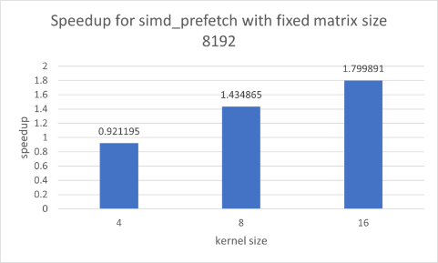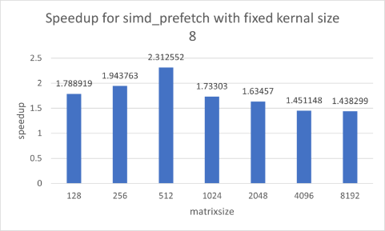
1. ### **Tiling\_SIMD\_Prefetching**

1\. Report the number of instructions and L1-D cache MPKI

|Subtask|Matrix Size|Kernel Size|Tile Size|#Instructions|L1D misses|MPKI|
| :- | :- | :- | :- | :- | :- | :- |
||||||||
|only\_tiling\_simd\_prefetching|128|8|16|21096943|37563|1\.780494928|
|only\_tiling\_simd\_prefetching|256|8|16|84914802|280571|3\.304147138|
|only\_tiling\_simd\_prefetching|512|8|16|344305894|1875843|5\.448187303|
|only\_tiling\_simd\_prefetching|1024|8|16|1390741936|7650935|5\.501333354|
|only\_tiling\_simd\_prefetching|2048|8|16|5593201297|29633439|5\.298117737|
|only\_tiling\_simd\_prefetching|4096|8|16|22456110718|121722660|5\.420469356|
|only\_tiling\_simd\_prefetching|8192|8|16|89973721796|454227603|5\.048447413|
||||||||
|only\_tiling\_simd\_prefetching|8192|4|16|35835377046|214957508|5\.998472061|
|only\_tiling\_simd\_prefetching|8192|8|16|89971568841|473702668|5\.265026209|
|only\_tiling\_simd\_prefetching|8192|16|16|2\.94251E+11|3985236805|13\.543672|
||||||||
|only\_tiling\_simd\_prefetching|8192|8|8|90053828014|545948390|6\.062467327|
|only\_tiling\_simd\_prefetching|8192|8|16|89969727018|466284989|5\.182687605|
|only\_tiling\_simd\_prefetching|8192|8|32|2\.94252E+11|3974541764|13\.50725706|

2\. Compare the performance by calculating the speedup. & 3. Do this for multiple matrix sizes, tile sizes and kernel sizes and analyze the results. 

|Subtask|Matrix Size|Kernel Size|Tile Size|#Instructions|L1D misses|MPKI|Naive time|Technique time|Speedup|
| :- | :- | :- | :- | :- | :- | :- | :- | :- | :- |
|||||||||||
|speed\_tiling\_simd\_prefetch|128|8|16|56767045|48486|0\.854122317|0\.004961|0\.002183|2\.272561|
|speed\_tiling\_simd\_prefetch|256|8|16|235564523|319057|1\.354435702|0\.017027|0\.00833|2\.044058|
|speed\_tiling\_simd\_prefetch|512|8|16|963699258|2681122|2\.782114833|0\.05925|0\.03368|1\.759204|
|speed\_tiling\_simd\_prefetch|1024|8|16|3902076877|11304424|2\.897027495|0\.242127|0\.134174|1\.804575|
|speed\_tiling\_simd\_prefetch|2048|8|16|15708995385|44729249|2\.847365341|0\.974942|0\.517713|1\.883171|
|speed\_tiling\_simd\_prefetch|4096|8|16|63052838037|183543141|2\.910941787|3\.962657|1\.911056|2\.073543|
|speed\_tiling\_simd\_prefetch|8192|8|16|2\.52656E+11|724685126|2\.868269759|15\.862738|7\.787283|2\.037005|
|||||||||||
|speed\_tiling\_simd\_prefetch|8192|4|16|80327986159|275106381|3\.424788721|4\.69324|2\.69457|1\.74174|
|speed\_tiling\_simd\_prefetch|8192|8|16|2\.52656E+11|739201857|2\.925727125|15\.853882|7\.79865|2\.032901|
|speed\_tiling\_simd\_prefetch|8192|16|16|9\.23812E+11|7203329447|7\.797401342|57\.192662|27\.619518|2\.070734|
|||||||||||
|speed\_tiling\_simd\_prefetch|8192|8|8|2\.5274E+11|795476381|3\.147413563|15\.832977|8\.139493|1\.945204|
|speed\_tiling\_simd\_prefetch|8192|8|16|2\.52656E+11|732351576|2\.898607124|16\.082673|7\.788211|2\.065002|
|speed\_tiling\_simd\_prefetch|8192|8|32|2\.52616E+11|702571038|2\.781182994|15\.739189|7\.630609|2\.062639|

3\. Plot the MPKI & speedup for different matrix sizes and kernel sizes of your choice. Select the sizes such that you can draw clear conclusions from the results.

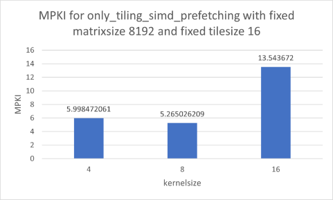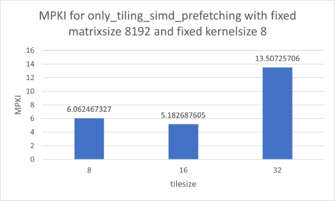

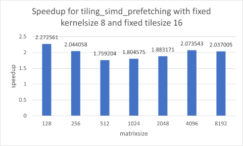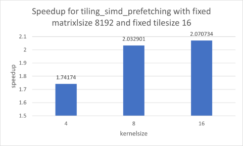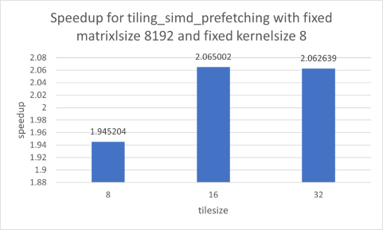

1. ### **Compare the performance improvement achieved by each technique against the baseline implementation.**
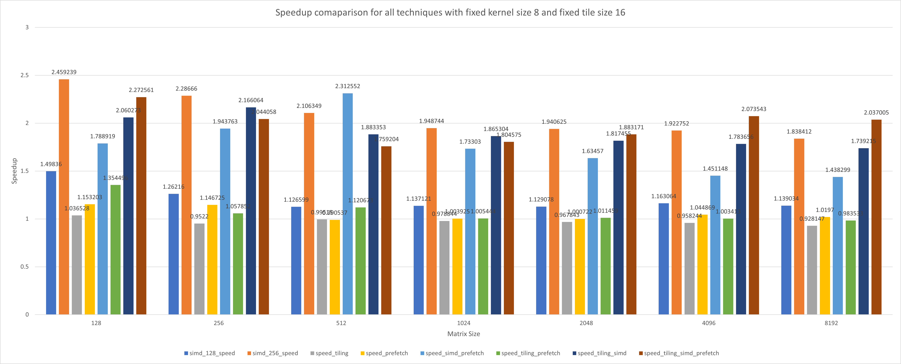

